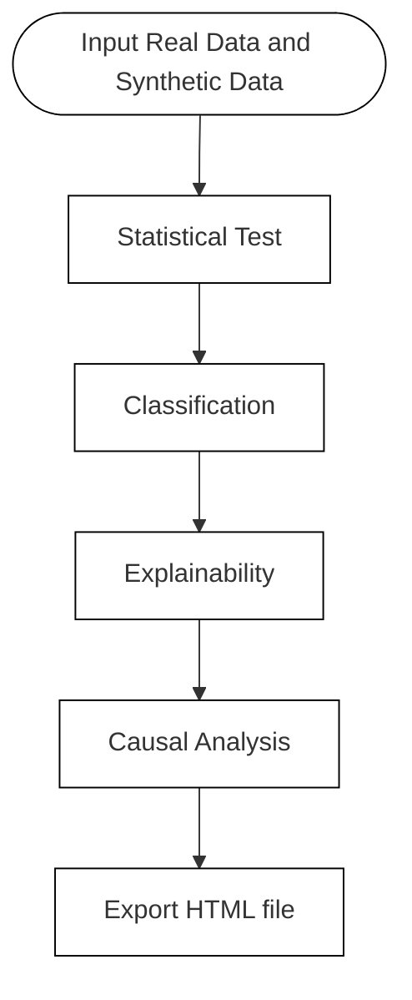

<h1 align="center">SDQCPy</h1>
<p align="center"><strong>SDQCPy is a comprehensive Python package designed for synthetic data management.</strong></p>

## Table of Contents

- [Features](#features)
- [Installation](#installation) 
- [Usage](#usage)
    - [Demo](#demo)
    - [Data Synthesis](#data-synthesis)
- [Workflow](#workflow)
- [Support](#support)

## Features

`SDQCPy` provides a comprehensive toolkit for synthetic data generation, quality assessment, and analysis:

1. **Data Synthesis**: Generate synthetic data using various models.
2. **Quality Evaluation**: Assess the quality of synthetic data through statistical tests, classification metrics, explainability analysis, and causal inference.
3. **End-to-End Analysis**: Perform end-to-end analysis by integrating multiple evaluation methods to provide a holistic view of the synthetic data quality.

## Installation
***You can install `SDQCPy` using pip:***

```bash
pip install sdqcpy
```
***Alternatively, you can install it from the source:***

```bash
git clone https://github.com/T0217/sdqcpy.git
cd sdqcpy
pip install -e .
```

## Usage

### Demo

You can use the following code to achieve the process from data synthesis to sequential analysis:
```python
import pandas as pd
from sdqc_synthesize import YDataSynthesizer
from sdqc_integration import SequentialAnalysis
import logging
import warnings

# Ignore warnings and set logger level to ERROR
warnings.filterwarnings('ignore')
logger = logging.getLogger()
logger.setLevel(logging.ERROR)

random_seed = 17

raw_data = pd.read_csv("raw_data.csv")  # Please replace with your own data path

# Synthesize data
synth = YDataSynthesizer(
    data=raw_data,
    random_seed=random_seed
)
synthetic_data = synth.generate()

# Perform sequential analysis
sequential = SequentialAnalysis(raw_data, synthetic_data)
results = sequential.run()
```

### Data Synthesis

`SDQCPy` supports various methods, the implementation of these methods are using [`ydata-synthetic`](https://github.com/ydataai/ydata-synthetic) and [`SDV`](https://github.com/sdv-dev/SDV).

>   [!Tip]
>
>   ***We only display simple code here, and the parameters of each model can be further modified as needed.***

-   **YData Synthesizer**

    ```python
    import pandas as pd
    from sdqc_synthesize import YDataSynthesizer

    raw_data = pd.read_csv("raw_data.csv")  # Please replace with your own data path
    ydata_synth = YDataSynthesizer(data=raw_data)
    synthetic_data = ydata_synth.generate()
    ```

- **SDV Synthesizer**

    ```python
    import pandas as pd
    from sdqc_synthesize import SDVSynthesizer
    
    raw_data = pd.read_csv("raw_data.csv")  # Please replace with your own data path
    sdv_synth = SDVSynthesizer(data=raw_data)
    synthetic_data = sdv_synth.generate()
    ```

## Workflow
`SDQCPy` use the process shown below to perform the quality check and analysis:


- **Statistical Test**
`SDQCPy` employs various methods for *descriptive analysis*, *distribution comparison*, and *correlation testing* tailored to ***different data types***.
- **Classification**
`SDQCPy` employs machine learning models(`SVC`, `RandomForestClassifier`, `XGBClassifier`, `LGBMClassifier`) to evaluate the similarity between the real and synthetic data.
- **Explainability**
`SDQCPy` employs several of the current mainstream explainability methods(`SHAP`, `LIME`, `PFI`) to evaluate the explainability of the synthetic data.
- **Causal Analysis**
`SDQCPy` employs several causal structure learning methods and evaluation metrics to compare the adjacency matrix of the raw and synthetic data. The implementation of these methods are using [`gCastle`](https://github.com/huawei-noah/trustworthyAI/tree/master/gcastle)
- **End-to-End Analysis**
To streamline the process of calling individual modules one by one, we have integrated all the functions. If you have specific needs, you can also use these functions along your lines.

## Support

Need help? Report a bug? Ideas for collaborations? Reach out via [GitHub Issues](https://github.com/T0217/sdqcpy/issues)

>   [!IMPORTANT]
>
>   Before reporting an issue on GitHub, check out Common Issues.

