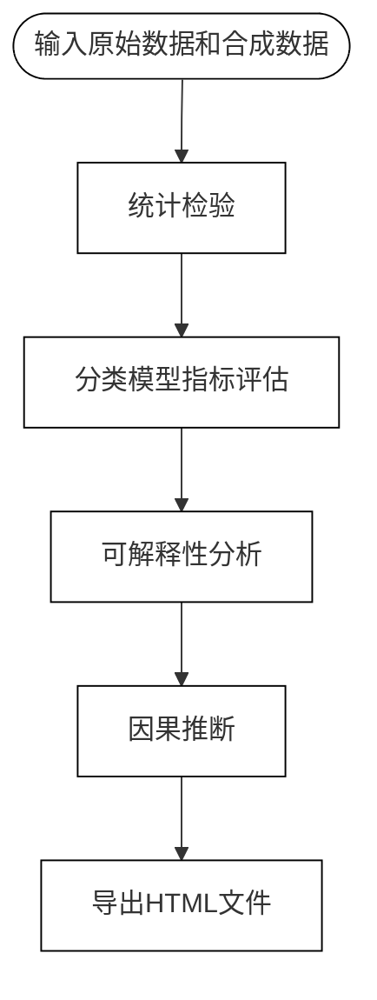

<h1 align="center">SDQCPy</h1>
<p align="center"><strong>SDQCPy：一个全面的合成数据管理的Python包</strong></p>

## 目录

- [功能](#功能)
- [安装](#安装)
- [结果展示](#结果展示)
- [使用方法](#使用方法)
    - [示例](#示例)
    - [数据合成](#数据合成)
- [工作流程](#工作流程)
- [支持](#支持)
- [许可证](#许可证)

## 功能

`SDQCPy` 提供了一个全面的工具包，用于合成数据生成、质量评估和分析：

1. **数据合成**：使用多种模型生成合成数据。
2. **质量评估**：通过统计检验、分类模型指标评估、可解释性分析和因果推断来评估合成数据质量。
3. **端到端分析**：通过集成多种评估方法，提供用于评估合成数据质量的序贯分析。
4. **结果展示**：将结果存储在*HTML文件*中。

## 安装
***您可以使用pip安装`SDQCPy`：***

```bash
pip install sdqcpy
```

***或者从源代码安装：***

```bash
git clone https://github.com/T0217/sdqcpy.git
cd sdqcpy
pip install -e .
```

## 结果展示

`SDQCPy` 提供了`SequentialAnalysis`类进行分析，并将结果存储在*HTML文件*中。


## 使用方法

### 示例
您可以使用以下代码来实现序贯分析，并将结果存储在*HTML文件*中：

```python
from sdqc_integration import SequentialAnalysis
from sdqc_data import read_data
import logging
import warnings

# 忽略警告并设置日志级别为ERROR
warnings.filterwarnings('ignore')
logger = logging.getLogger()
logger.setLevel(logging.ERROR)

# 设置随机数种子
random_seed = 17

# 请用您的数据路径替换，并使用pandas读取数据
raw_data = read_data('3_raw')
synthetic_data = read_data('3_synth')

output_path = 'raw_synth.html'

# 进行序贯分析
sequential = SequentialAnalysis(
    raw_data=raw_data,
    synthetic_data=synthetic_data,
    random_seed=random_seed,
    use_cols=None,
)
results = sequential.run()
sequential.visualize_html(output_path)
```

### 数据合成

`SDQCPy` 提供了多种生成合成数据的方法，这些方法的实现使用[`ydata-synthetic`](https://github.com/ydataai/ydata-synthetic) 和 [`SDV`](https://github.com/sdv-dev/SDV)。

> [!TIP]
>
>   ***本库仅展示简单代码，每个模型的参数可以根据您的需求进行进一步修改。***

-   **YData Synthesizer**

    ```python
    import pandas as pd
    from sdqc_synthesize import YDataSynthesizer
    
    raw_data = pd.read_csv("raw_data.csv")  # 请用您的数据路径替换
    ydata_synth = YDataSynthesizer(data=raw_data)
    synthetic_data = ydata_synth.generate()
    ```

>   [!IMPORTANT]
>
>   ***在最新版本中，[`ydata-synthetic`](https://github.com/ydataai/ydata-synthetic) 已经切换到使用 [ydata-sdk](https://github.com/ydataai/ydata-sdk)。然而，由于合成数据只是本库的补充功能，因此尚未更新。***

- **SDV Synthesizer**

    ```python
    import pandas as pd
    from sdqc_synthesize import SDVSynthesizer
    
    raw_data = pd.read_csv("raw_data.csv")  # 请用您的数据路径替换
    sdv_synth = SDVSynthesizer(data=raw_data)
    synthetic_data = sdv_synth.generate()
    ```

## 工作流程

`SDQCPy` 使用以下流程进行质量检验和分析：



- **统计检验**
    `SDQCPy` 针对***不同的数据类型***，使用多种方法进行*描述性分析*、*分布比较* 和*相关性检验*。
- **分类模型指标评估**
    `SDQCPy` 使用多种机器学习模型（`SVC`, `RandomForestClassifier`, `XGBClassifier`, `LGBMClassifier`）来评估原始数据和合成数据的相似性。
- **可解释性分析**
    `SDQCPy` 使用多种当前主流的可解释性分析方法（`Model-Based`，`SHAP`，`PFI`）来评估分类模型的可解释性。
- **因果推断**
    `SDQCPy` 使用多种因果结构学习方法和评估指标来比较原始数据和合成数据的邻接矩阵，这些方法的实现使用 [`gCastle`](https://github.com/huawei-noah/trustworthyAI/tree/master/gcastle)。
- **端到端分析**（名为 `SequentialAnalysis`）
    为了简化调用各个模块的过程，本库已经将所有功能集成在一起。如果您有特定需求，也可以根据您的需求使用这些功能。

## 支持

如果您有任何问题或建议，请随时在 [GitHub Issues](https://github.com/T0217/sdqcpy/issues) 上提出。

>   [!IMPORTANT]
>
>   ***在 `GitHub` 提出 Issue 之前，请先检查已有的 [Issues](https://github.com/T0217/sdqcpy/issues) 以避免重复。***
>
>   ***如果您希望共同开发，<span style="color: red;">请先在 `GitHub` 上打开一个 Issue 来讨论您的提议。</span> 一旦讨论完毕，您可以提交一个 Pull Request。***

## 许可证

[Apache-2.0](LICENSE) @[T0217](https://github.com/T0217)


